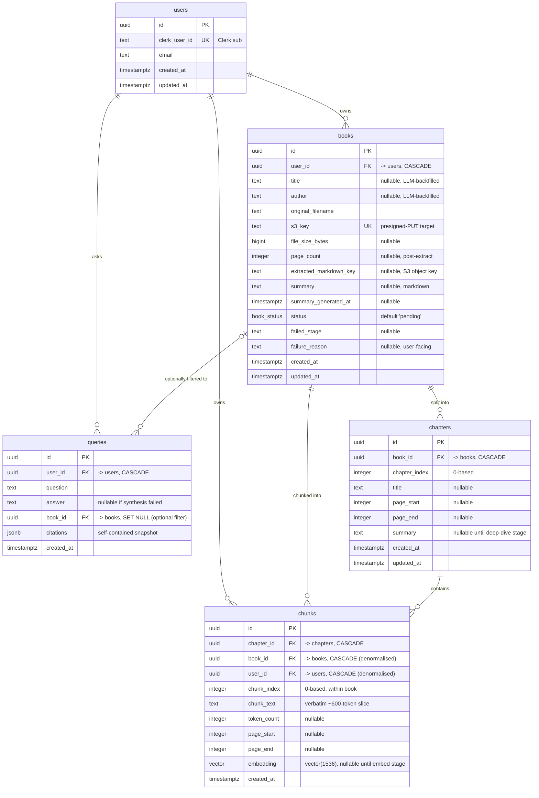

# Data model & schema

Resolution of wayfinder ticket [Data model & schema](https://github.com/Cal3574/scriptorium/issues/3) (part of [Wayfinder map: Scriptorium MVP](https://github.com/Cal3574/scriptorium/issues/2)).

This locks the full Postgres schema for the MVP: every table, column, type, nullability, the `book_status` enum and its transitions, the `ON DELETE` graph, the pgvector index, how Clerk identity is represented, and the Drizzle module + migration workflow.

## Conventions

- **Primary keys:** `uuid` everywhere, `default gen_random_uuid()` (built into Postgres 13+, no extension). Book IDs appear in URLs and SSE paths; non-enumerable IDs suit a multi-user app. Tables are tiny (tens of books per user) so index locality / uuid v7 ordering does not matter - plain v4.
- **Timestamps:** `timestamptz`. `created_at` and `updated_at` (both `not null default now()`) on `users`, `books`, `chapters`. `created_at` only on `chunks` and `queries` (never updated in place - a chunk getting its embedding filled is not worth an `updated_at`).
- **`updated_at` maintenance:** in application code (the Drizzle repository layer sets `updated_at` on every update), **not** a Postgres trigger. Keeps migrations pure drizzle-kit-generated DDL with no hand-written trigger functions. All writes go through the `api` / `worker` repos.
- **Enums:** exactly one - `book_status` - as a native Postgres enum via Drizzle `pgEnum`. Small, stable value set; compact and type-safe. `chapters` has no status enum (see below).
- **Raw rows never cross a boundary:** per the monorepo layout decision ([#4](https://github.com/Cal3574/scriptorium/issues/4)), explicit mapper functions (`toBookDto`, ...) in `api` / `server-core` convert Drizzle rows to contract DTOs. `chapters.content` (if it lands - see deferrals) and `chunks.chunk_text` / `chunks.embedding` are never in a DTO by default.

## Entity-relationship diagram



## Tables

### `users`

Local identity. Clerk owns authentication; the local `users.id` is the ownership key used by every `user_id` foreign key and the authorization guard. Rows are provisioned by JIT upsert in the Nest auth guard (keyed on `clerk_user_id`), optionally reinforced by a Clerk `user.created` / `user.deleted` webhook. This decouples the schema from Clerk - the vendor can be swapped by repopulating `clerk_user_id`.

| Column | Type | Null | Notes |
|---|---|---|---|
| `id` | `uuid` | no | PK, `default gen_random_uuid()` |
| `clerk_user_id` | `text` | no | **unique**; Clerk's `sub` claim |
| `email` | `text` | no | denormalised from Clerk for support / debug lookup; refreshed on each JIT upsert |
| `created_at` | `timestamptz` | no | `default now()` |
| `updated_at` | `timestamptz` | no | `default now()`, app-maintained |

No `name` / `image_url` / roles / soft-deactivate flag - the client already holds the Clerk user object for display; the DB needs only identity + ownership.

### `books`

One row per uploaded book. `title` and `author` are **nullable** and backfilled during the extract stage: after LlamaParse returns markdown, a single cheap Claude call takes the first ~2 pages and returns `{ title, author }` (or nulls). LlamaParse has no reliable title metadata and no TOC, so the LLM is the mechanism. The client may send an optional `title` on `POST /books`; if present it wins and the LLM step is skipped. Until backfill lands, Library and Book-detail render `original_filename` as the placeholder.

| Column | Type | Null | Notes |
|---|---|---|---|
| `id` | `uuid` | no | PK |
| `user_id` | `uuid` | no | FK -> `users(id)` `ON DELETE CASCADE` |
| `title` | `text` | yes | LLM-backfilled or client override |
| `author` | `text` | yes | LLM-backfilled |
| `original_filename` | `text` | no | |
| `s3_key` | `text` | no | **unique**; the presigned-PUT target for the original PDF |
| `file_size_bytes` | `bigint` | yes | from S3 head or client |
| `page_count` | `integer` | yes | filled after extraction |
| `extracted_markdown_key` | `text` | yes | S3 object key for the full LlamaParse markdown (see below) |
| `summary` | `text` | yes | whole-book high-level summary, markdown |
| `summary_generated_at` | `timestamptz` | yes | for a "summary is N days old" hint and debugging |
| `status` | `book_status` | no | `default 'pending'` - UX / SSE display only |
| `failed_stage` | `text` | yes | set on failure, e.g. `'embedding'` |
| `failure_reason` | `text` | yes | user-facing message |
| `created_at` | `timestamptz` | no | `default now()` |
| `updated_at` | `timestamptz` | no | `default now()`, app-maintained |

Model name and per-book token cost are **not** stored - the model is pinned in `config`, cost goes to logs.

### `chapters`

One row per detected chapter. Chapter detection (LlamaParse `#`/`##` headings + "Chapter N" regex fallback) is the concern of ticket [#7](https://github.com/Cal3574/scriptorium/issues/7); this schema only holds the result. `title`, `page_start`, `page_end` are all nullable because the regex fallback may not capture a heading and LlamaParse page numbers can be missing.

| Column | Type | Null | Notes |
|---|---|---|---|
| `id` | `uuid` | no | PK |
| `book_id` | `uuid` | no | FK -> `books(id)` `ON DELETE CASCADE` |
| `chapter_index` | `integer` | no | 0-based order within the book |
| `title` | `text` | yes | heading text |
| `page_start` | `integer` | yes | |
| `page_end` | `integer` | yes | |
| `summary` | `text` | yes | per-chapter deep-dive; nullable until the summary stage fills it |
| `created_at` | `timestamptz` | no | `default now()` |
| `updated_at` | `timestamptz` | no | `default now()`, app-maintained |
| | | | **unique** `(book_id, chapter_index)` |

**No `chapter_status` enum.** With derive-from-data resumption a chapter has exactly two observable states, both derivable: `summary is null` (deep-dive pending) / `summary is not null` (done). SSE messages like "summarising chapter 4 of 12" are `count(*) filter (where summary is not null)` over the book's chapters. A status enum would only mirror `summary is null`.

### `chunks`

One row per sub-chapter chunk (~600 tokens, ~80 overlap, paragraph-aligned - parameters are config-driven and owned by [#7](https://github.com/Cal3574/scriptorium/issues/7) / [#11](https://github.com/Cal3574/scriptorium/issues/11)). `book_id` and `user_id` are **denormalised** onto the chunk (in addition to the `chapter_id` parent) so the RAG hot path is a single-table indexed query with no joins just to filter. Both are immutable after insert - book ownership never transfers - so there is no sync hazard.

| Column | Type | Null | Notes |
|---|---|---|---|
| `id` | `uuid` | no | PK |
| `chapter_id` | `uuid` | no | FK -> `chapters(id)` `ON DELETE CASCADE` |
| `book_id` | `uuid` | no | FK -> `books(id)` `ON DELETE CASCADE` (denormalised) |
| `user_id` | `uuid` | no | FK -> `users(id)` `ON DELETE CASCADE` (denormalised) |
| `chunk_index` | `integer` | no | 0-based order within the book |
| `chunk_text` | `text` | no | verbatim ~600-token slice; shown under the RAG answer |
| `token_count` | `integer` | yes | for token-budget math in [#7](https://github.com/Cal3574/scriptorium/issues/7) / [#11](https://github.com/Cal3574/scriptorium/issues/11) |
| `page_start` | `integer` | yes | |
| `page_end` | `integer` | yes | |
| `embedding` | `vector(1536)` | yes | OpenAI `text-embedding-3-small`; **nullable** until the embed stage fills it |
| `created_at` | `timestamptz` | no | `default now()` |
| | | | **unique** `(book_id, chunk_index)` |

`chunk_text` is intentionally duplicated: it lives inside the S3 markdown blob (as part of the whole book) *and* sliced into `chunks.chunk_text`. The duplication is cheap (a book is ~500 KB of text) and required - pgvector search needs `chunk_text` and `embedding` co-located in a Postgres table.

### `queries`

One row per RAG query. Every cross-book synthesis is a paid, multi-second Claude call; persisting the result lets the user revisit past answers without re-running them, and is the natural place to inspect retrieval quality while [#11](https://github.com/Cal3574/scriptorium/issues/11) is tuned. Whether the client ships a history UI in the MVP is [#9](https://github.com/Cal3574/scriptorium/issues/9)'s call - the table does not force it.

| Column | Type | Null | Notes |
|---|---|---|---|
| `id` | `uuid` | no | PK |
| `user_id` | `uuid` | no | FK -> `users(id)` `ON DELETE CASCADE` |
| `question` | `text` | no | |
| `answer` | `text` | yes | null if synthesis failed |
| `book_id` | `uuid` | yes | FK -> `books(id)` `ON DELETE SET NULL`; the optional single-book filter |
| `citations` | `jsonb` | yes | self-contained snapshot: `[{ book_title, chapter_title, chunk_text, chunk_id }]` |
| `created_at` | `timestamptz` | no | `default now()` |

`citations` stores **display text, not foreign keys**. A history entry must still render after a cited book is deleted, so each entry is a frozen record. `book_id` is `SET NULL` for the same reason - the entry survives, it just loses the filter pointer.

## `book_status` enum and transitions

Values: `pending`, `extracting`, `chunking`, `embedding`, `summarizing`, `ready`, `failed`, `deleting`.

```
pending -> extracting -> chunking -> embedding -> summarizing -> ready
(any non-terminal)      -> failed
(any state)             -> deleting        [row is then removed]
failed                  -> pending         [retry: re-enqueue the job]
ready                   -> deleting
```

`status` never moves backward except the explicit `failed -> pending` retry. It is **UX / SSE display state only** - never the source of truth for pipeline resumption.

**Retry:** the API sets `status = 'pending'` and re-enqueues the BullMQ job. The worker's derive-from-data checks skip every stage whose artifact already exists and bump `status` forward as they go, so a book that failed at embedding runs `failed -> pending -> embedding -> summarizing -> ready`, re-doing only unfinished work. There is no "resume at stage X" state to store - the data *is* the resume point.

## Pipeline resumption: derive-from-data

The BullMQ ingest job (one sequential job per book, detailed in [#8](https://github.com/Cal3574/scriptorium/issues/8)) is a fixed list of stages. Each stage is a `(isComplete, run)` pair. On every job start - first attempt or any retry - the worker walks the list from the top, skipping any stage whose output is already present:

```ts
const stages = [extractStage, identifyBookStage, chunkStage, embedStage, bookSummaryStage, chapterSummaryStage];
for (const stage of stages) {
  if (await stage.isComplete(bookId, db)) continue;
  await publishStatus(bookId, stage.enterStatus);   // SSE display
  await stage.run(bookId, db, deps);
}
await setStatus(bookId, 'ready');
```

No stage trusts a "current step" pointer; each asks the database whether **its own artifact** exists:

| Stage | `isComplete` when |
|---|---|
| extract | `books.extracted_markdown_key is not null` |
| identify book | `books.title is not null` (or the client sent an override) |
| chunk | `exists (select 1 from chapters where book_id = $1)` |
| embed | chunk count > 0 **and** `count(*) from chunks c join chapters ch on ch.id = c.chapter_id where ch.book_id = $1 and c.embedding is null` = 0 |
| book summary | `books.summary is not null` |
| chapter summaries | `not exists (select 1 from chapters where book_id = $1 and summary is null)` |

The nullability of `chunks.embedding` and `chapters.summary` is what makes a *partial* stage visible: chunk rows are inserted with `embedding = null` then filled in batches, so a worker that dies after 300 of 800 embeddings resumes on the remaining 500 (`... where embedding is null order by chunk_index limit $batch`). Same for the per-chapter deep-dive loop.

If `status` is stale (crash between `publishStatus` and `run`), nothing breaks - the next job start recomputes reality from these six checks.

## `ON DELETE` graph

| Foreign key | On delete | Rationale |
|---|---|---|
| `books.user_id -> users` | `CASCADE` | Clerk `user.deleted` webhook removes the user -> their books go |
| `chapters.book_id -> books` | `CASCADE` | |
| `chunks.chapter_id -> chapters` | `CASCADE` | |
| `chunks.book_id -> books` | `CASCADE` | denormalised path, same outcome |
| `chunks.user_id -> users` | `CASCADE` | denormalised path |
| `queries.user_id -> users` | `CASCADE` | |
| `queries.book_id -> books` | `SET NULL` | history entry survives, loses its filter pointer |

Multiple cascade paths reach `chunks` (via chapter, via book, via user); Postgres deletes the row once regardless of path.

### Delete flow (user deletes a book in Library)

1. `DELETE /books/:id` -> API sets `books.status = 'deleting'`, enqueues a **delete job**, returns `202`.
2. Delete job:
   1. Removes the ingest job from BullMQ if still queued; if active, waits for it to notice `status = 'deleting'` at its next stage boundary and abort.
   2. Deletes both S3 objects - the original PDF (`s3_key`) and the extracted markdown (`extracted_markdown_key`).
   3. Deletes the `books` row. Postgres cascades `chapters` + `chunks`, nulls `queries.book_id`.
   4. Idempotent - a second run finds no row and no-ops.
3. The in-flight ingest job checks `books.status` (or row existence) at every stage boundary; `deleting` or gone -> discard work, exit cleanly. No partial writes survive.

Async (a delete job) rather than inline in the request avoids the race where an active ingest job inserts chunk rows *after* the cascade delete. The exact BullMQ coordination between the delete job and an active ingest job is [#8](https://github.com/Cal3574/scriptorium/issues/8)'s detail; the schema commitment here is the `deleting` enum value and `SET NULL` on `queries.book_id`.

## The extracted markdown blob

The full LlamaParse markdown output for a book is stored as **one S3 object**, referenced by `books.extracted_markdown_key`. It is not queried at runtime. It exists as:

- the input the chunk stage reads (split into `chapters`, then `chunks`);
- the re-chunk source if chunk parameters are tuned later - so LlamaParse (~$1.13 for a 300-page book) is never re-paid;
- the resumption checkpoint for the extract stage.

Front matter / TOC / appendices that do not fall under a chapter heading are not persisted anywhere except this blob.

## pgvector index

```sql
CREATE EXTENSION IF NOT EXISTS vector;   -- hand-added to the first migration; drizzle-kit will not emit it

CREATE INDEX chunks_embedding_hnsw
  ON chunks
  USING hnsw (embedding vector_cosine_ops)
  WITH (m = 16, ef_construction = 64)
  WHERE embedding IS NOT NULL;
```

- **HNSW, not IVFFlat.** Books are ingested one at a time, continuously, fully automatically. IVFFlat must be built after representative data exists and its centroids go stale as data grows - that fights FULL-AUTO incremental ingestion (a perpetual rebuild cron, inaccurate searches between rebuilds). HNSW builds incrementally as rows arrive and has better recall / latency. Its cost is memory (~1 GB at tens of thousands of chunks) - a server-config concern, not a schema one.
- **`vector_cosine_ops` / `<=>`** - OpenAI `text-embedding-3-small` vectors are normalised; cosine is the right metric.
- **Partial `WHERE embedding IS NOT NULL`** - chunks exist un-embedded during ingest; keep them out of the index.
- `m` / `ef_construction` are pgvector defaults. Query-time `hnsw.ef_search` and top-k tuning are [#11](https://github.com/Cal3574/scriptorium/issues/11)'s job, not locked here.
- Assumes **pgvector >= 0.8** (iterative index scans, so the `WHERE user_id = ...` pre-filter does not wreck recall). The image tag is pinned by [#10](https://github.com/Cal3574/scriptorium/issues/10).

The RAG hot path:

```sql
SELECT chunk_text, book_id, chapter_id
FROM chunks
WHERE user_id = $me           -- cross-book default; add "AND book_id = $filter" for single-book
  AND embedding IS NOT NULL
ORDER BY embedding <=> $question_embedding
LIMIT 12;
```

## Non-vector indexes

| Index | Purpose |
|---|---|
| `users(clerk_user_id)` unique | JIT upsert lookup in the auth guard |
| `books(user_id)` | Library list; cascade |
| `books(s3_key)` unique | idempotent upload handoff |
| `chapters(book_id, chapter_index)` unique | ordering + cascade |
| `chunks(book_id, chunk_index)` unique | ordering + cascade |
| `chunks(chapter_id)` | cascade; citation lookups |
| `chunks(book_id) WHERE embedding IS NULL` partial | the embed stage's "next batch to embed" query |
| `queries(user_id, created_at DESC)` | history list |

## Drizzle module and migration workflow

Location is fixed by the monorepo layout decision ([#4](https://github.com/Cal3574/scriptorium/issues/4)): `packages/database` (`@scriptorium/database`), scope-tagged `scope:database`, framework-free (`server-core` wraps it in a Nest module; `providers` may not import it).

```
packages/database/
  drizzle.config.ts
  src/
    schema/
      enums.ts          -- bookStatus pgEnum
      users.ts books.ts chapters.ts chunks.ts queries.ts
      index.ts          -- re-exports the full schema
    client.ts           -- createDbClient(connectionString): NodePgDatabase<typeof schema>
    migrate.ts          -- programmatic drizzle-orm migrator; the production entrypoint
    migrations/         -- committed *.sql + meta/, generated by drizzle-kit
  package.json          -- exports "." and "./schema"; bin "scriptorium-migrate"
```

**Nx targets on `database`:** `generate`, `migrate`, `check`, plus standard `lint` / `test` / `typecheck`.

**Dev workflow:**

1. Edit a schema file.
2. `pnpm nx run database:generate` (wraps `drizzle-kit generate`) -> emits a numbered SQL file.
3. Review the SQL, commit it alongside the schema change.
4. `pnpm nx run database:migrate` applies pending migrations to the local compose Postgres ([#10](https://github.com/Cal3574/scriptorium/issues/10) owns the compose file).

**CI:** `drizzle-kit check` for drift (schema vs migrations must agree); migrations run against an ephemeral Postgres in the integration-test job.

**In-cluster (deploy):** the deploy artifact includes the compiled `migrate.ts`. A pre-deploy step (K8s Job / ArgoCD pre-sync hook - infra, out of scope) runs `scriptorium-migrate` against the cluster Postgres **before** new `api` / `worker` pods roll. It uses `drizzle-orm`'s programmatic `migrate()` (not `drizzle-kit`, a dev dependency), is idempotent, and tracks state in `__drizzle_migrations`. Pods **never** migrate on boot - two `api` replicas would race.

**pgvector caveat:** `drizzle-kit generate` does not emit `CREATE EXTENSION`. The first migration is hand-edited to prepend `CREATE EXTENSION IF NOT EXISTS vector;` before any `vector`-typed column or the HNSW index.

## Deferrals and hand-offs

- **`chapters.content` (chapter prose stored in Postgres) -> [#7](https://github.com/Cal3574/scriptorium/issues/7).** Whether to persist each chapter's full markdown text as a `content text` column hinges on whether the chapter deep-dive prompt reads whole chapter text or that chapter's chunks. If #7 concludes "raw chapter text", add a nullable `content` column by migration (the chunk stage already has the text in memory). Goes to the map's "Not yet specified".
- **Book summary structure -> [#7](https://github.com/Cal3574/scriptorium/issues/7).** `books.summary` is `text` (markdown). If #7 decides the client must address summary sections independently, change that one column to `jsonb` by migration. Not pre-committed.
- **Pipeline stage checks, SSE event schema, BullMQ retry / delete-job coordination -> [#8](https://github.com/Cal3574/scriptorium/issues/8).** Build on this schema.
- **API surface, `queries` history UI -> [#9](https://github.com/Cal3574/scriptorium/issues/9).**
- **`hnsw.ef_search`, top-k, similarity threshold, chunk de-duplication -> [#11](https://github.com/Cal3574/scriptorium/issues/11).**
